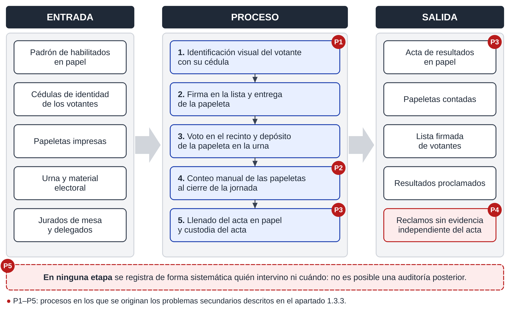

# Diagramas del informe

Las figuras se dibujan con código (PySide6/QPainter, ya instalado con el sistema), así se pueden
corregir y regenerar en segundos y quedan versionadas en git.

```bash
docs/diagramas/generar.sh            # todas las figuras
docs/diagramas/generar.sh fig_1_3    # solo las que empiezan así
```

Salida: `docs/adjuntos/diagramas/<nombre>.png` (300 ppp, 16 cm de ancho útil) y `.svg`, en **dos
versiones con el mismo contenido**: sobria (`<nombre>.png`) e ilustrada con iconos
(`<nombre>_ilustrada.png`). Comparación lado a lado en [[galeria]].

| Archivo | Figura | Dónde va |
|---|---|---|
| `fig_1_1_eps_actual.py` | 1.1 Esquema entrada–proceso–salida de la situación actual | 1.3.1 |
| `fig_1_2_dfd0_actual.py` | 1.2 DFD de contexto de la situación actual | 1.3.1 |
| `fig_1_3_dfd1_actual.py` | 1.3 DFD de nivel 1 de la situación actual | 1.3.1 |
| `fig_1_4_eps_propuesta.py` | 1.4 Esquema entrada–proceso–salida de la propuesta | 1.9.2 |
| `fig_1_5_contexto_propuesto.py` | 1.5 Diagrama de contexto propuesto | 1.9.2 |
| `fig_a1_arbol_problemas.py` | A1 Árbol de problemas | Anexo A |
| `fig_b1_arbol_objetivos.py` | B1 Árbol de objetivos | Anexo B |

- `lienzo.py`: primitivas (cajas, procesos y almacenes de DFD Gane-Sarson, entidades, cilindros,
  flechas con rótulo, marcos, insignias P1/O1). 800 unidades = 16 cm; texto base 13–14 ≈ 8 pt.
- `iconos.py`: 35 iconos vectoriales propios (personas, documentos, urna, huella, cámara, impresora,
  candado, llave, cadena de bloques, USB…) en estilo plano de dos tonos; color por tipo de objeto
  (`COLOR_ICONO` en `lienzo.py`). Catálogo: `muestra_iconos.py` → `muestra_iconos.png`.
- `Lienzo(ancho, alto, ilustrada)`: con `ilustrada=True`, las primitivas que reciben `icono=` lo
  dibujan; con `False` lo ignoran. Cada `fig_*.py` genera las dos versiones.
- `arbol.py`: geometría común del árbol de problemas y del de objetivos (uno es espejo del otro).
- Fuente Liberation Sans (mismas medidas que Arial). Paleta sobria legible en escala de grises.

En el Markdown, cada figura usa los estilos de la plantilla Word (APA 7, Art. 34):

```markdown
::: {custom-style="Rotulo Figura"}
**Figura 1.1**

*Título en cursiva*
:::

::: {custom-style="Imagen Figura"}
{width=16cm}
:::

::: {custom-style="Nota Figura"}
*Nota.* Elaboración propia.
:::
```
