# Galería de figuras: sobria e ilustrada

Cada figura existe en dos versiones con el **mismo contenido**: la *sobria* (la que usa hoy el informe) y la *ilustrada* (con iconos). Para usar la ilustrada en el informe basta con agregar `_ilustrada` al nombre del archivo en la línea `` del capítulo.

Se regeneran con `docs/diagramas/generar.sh`. Catálogo de iconos: ![[muestra_iconos.png|400]]

## Figura 1.1. Esquema entrada–proceso–salida de la situación actual

**Sobria**

**Ilustrada**

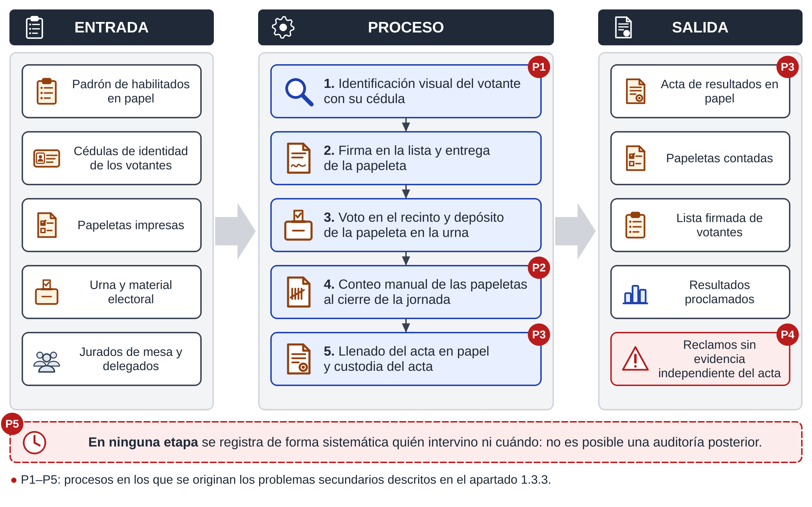

## Figura 1.2. DFD de contexto de la situación actual

**Sobria**

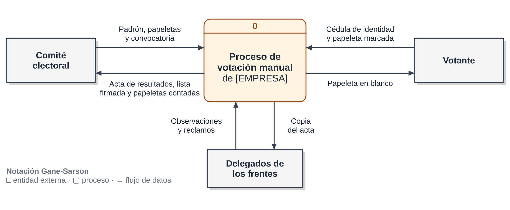

**Ilustrada**

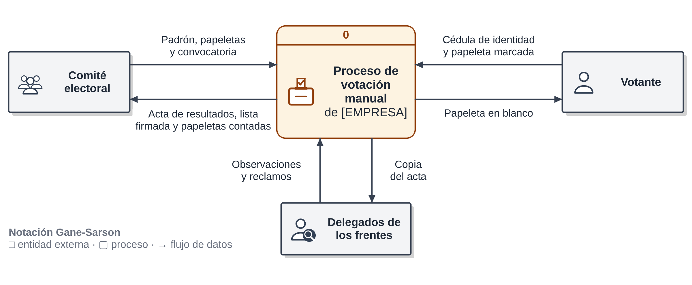

## Figura 1.3. DFD de nivel 1 de la situación actual

**Sobria**

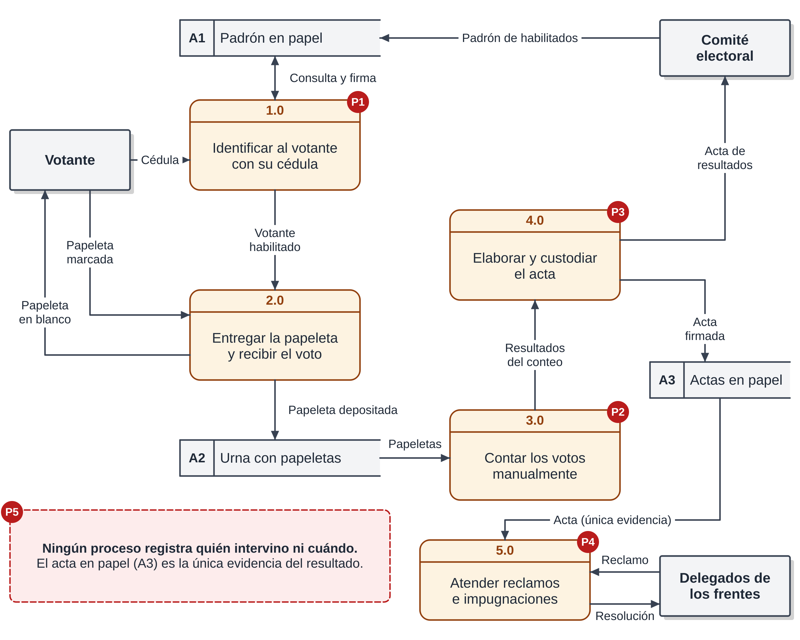

**Ilustrada**

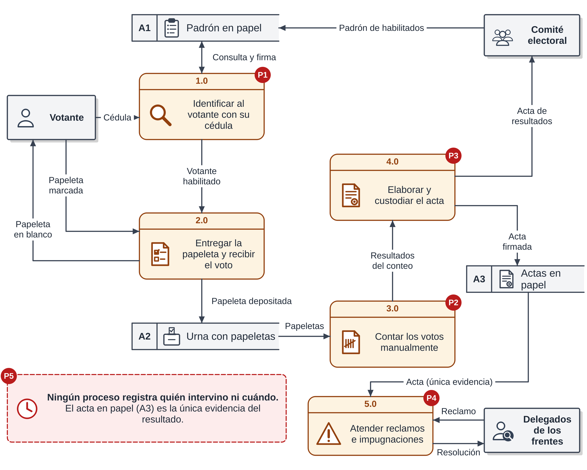

## Figura 1.4. Esquema entrada–proceso–salida de la propuesta

**Sobria**

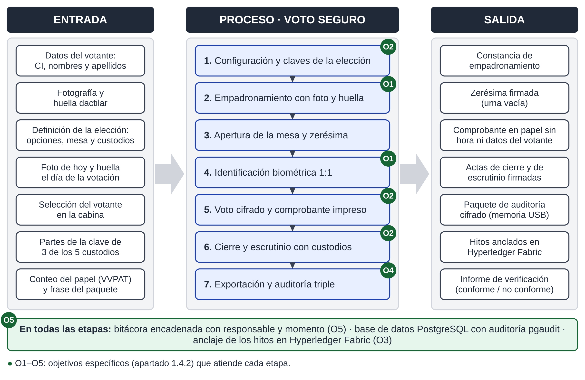

**Ilustrada**

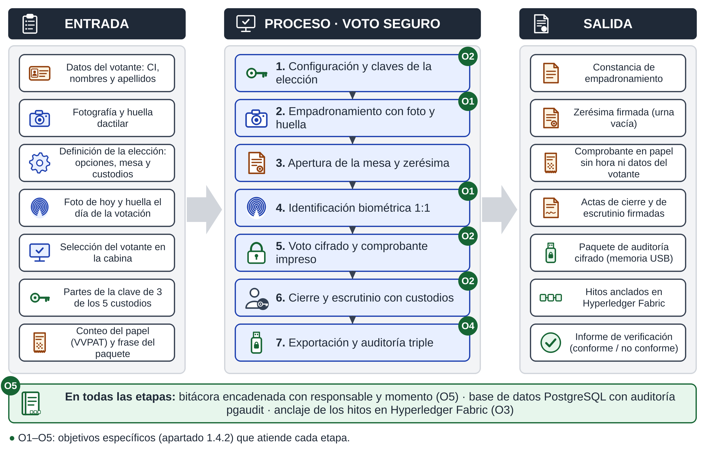

## Figura 1.5. Diagrama de contexto propuesto

**Sobria**

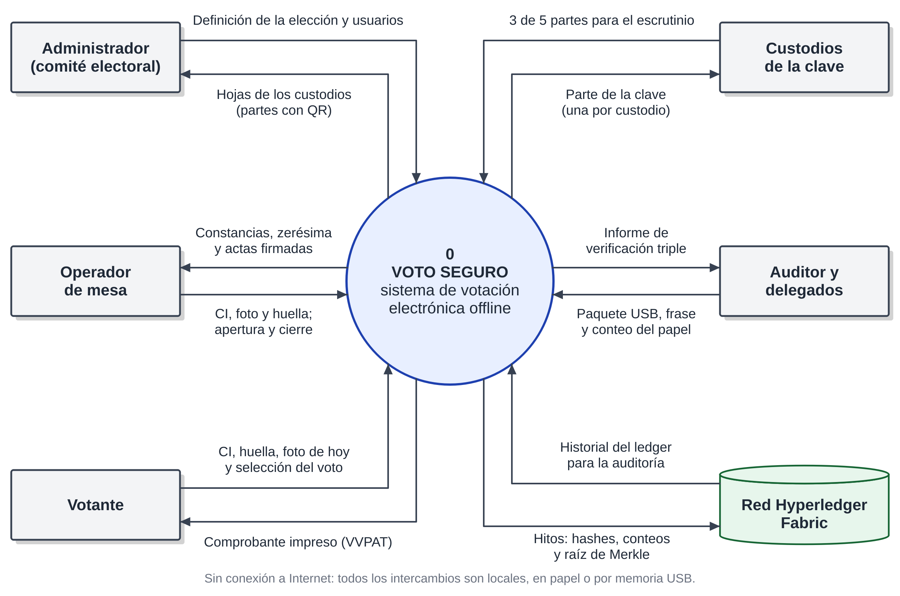

**Ilustrada**

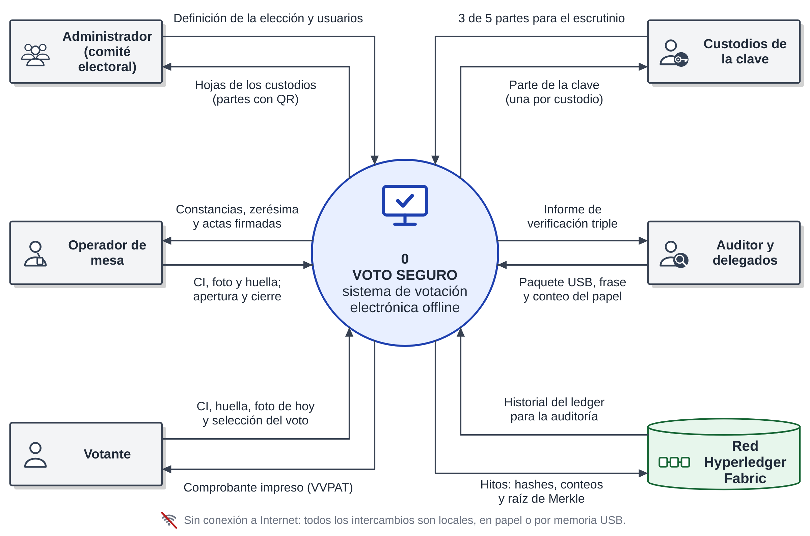

## Figura A1. Árbol de problemas

**Sobria**

**Ilustrada**

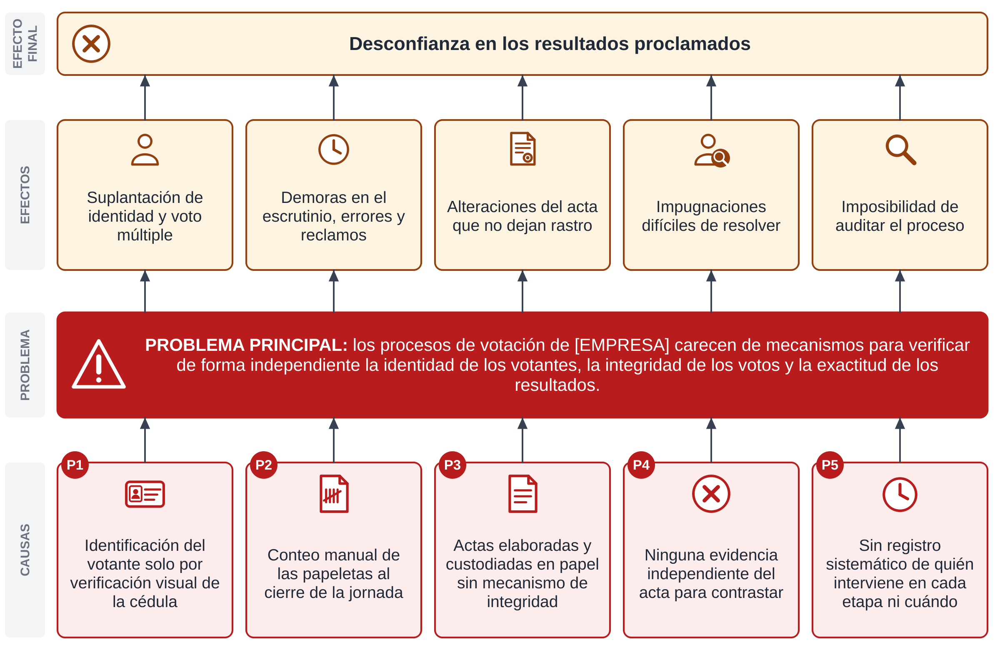

## Figura B1. Árbol de objetivos

**Sobria**

**Ilustrada**

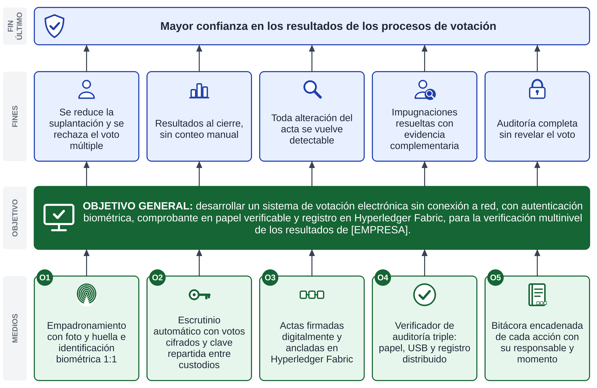
