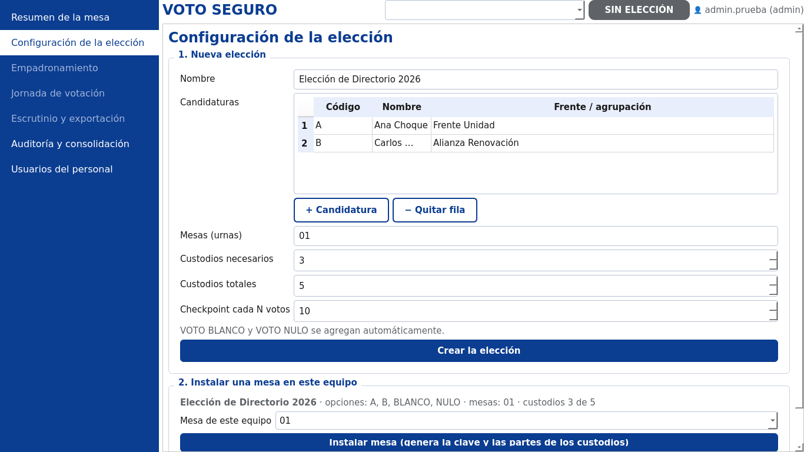

# ANEXOS {.unnumbered}

<!-- Reglamento Art. 48 + guía de la tutora:
 - Manual de usuario (operación + cómo hacer backups)            → Anexo A (borrador)
 - Manual técnico (hardware/software, instalación, mantenimiento) → Anexo B (borrador)
 - Estadísticas iniciales, DFD situación actual, árbol de problemas, árbol de objetivos
 - Fotos/documentos del proceso manual, esquema del TG
 - Formularios de métricas de calidad, conteo de líneas de código (herramienta)
 - Avales: institución, tutor metodológico, tutor, acta pre-defensa -->

## Anexo A. Manual de usuario {.unnumbered}

<!-- Borrador generado a partir del sistema (Sprint 6). Revisar redacción y numerar figuras. -->

### A.1. Roles del personal {.unnumbered}

| Rol | Qué puede hacer |
|---|---|
| Administrador | Crear la elección, instalar la mesa, exportar/importar la definición, crear usuarios; además, todo lo del operador y del auditor |
| Operador de mesa | Empadronar, abrir la mesa, identificar a los votantes, habilitar la cabina, cerrar, escrutar y exportar |
| Auditor | Verificar los paquetes de las mesas y consolidar los resultados |
| Custodio | Guardar su hoja con la parte de la clave y entregarla en el escrutinio |

### A.2. Ingreso y salida del sistema {.unnumbered}

1. Al encender el programa se pide la **frase del llavero** del equipo (la custodia el administrador). La primera vez se crea el llavero y la cuenta del administrador.
2. Cada persona ingresa con su **usuario y contraseña**. Tras tres intentos fallidos el acceso se bloquea cinco minutos. Todos los intentos quedan registrados.
3. Para cerrar el programa se usa el botón **Salir** (arriba a la derecha), que vuelve a pedir la contraseña. La ventana no se cierra con la «X».

### A.3. Configuración de la elección (administrador) {.unnumbered}

1. Menú **Configuración** → escribir el nombre de la elección y las candidaturas (código, nombre y frente). VOTO BLANCO y VOTO NULO se agregan solos.
2. Indicar las mesas (por ejemplo `01, 02, 03`), cuántos custodios hay y cuántos se necesitan para el escrutinio (por defecto, 3 de 5). Pulsar **Crear la elección**.
3. Elegir la mesa de este equipo y pulsar **Instalar mesa**. Se imprimen las hojas de los custodios: entregar cada una en un sobre sellado.
4. Si hay varias urnas: **Exportar definición…** a un USB y, en cada urna, **Importar definición…** comparando la huella impresa en la hoja de control.

### A.4. Empadronamiento (operador) {.unnumbered}

1. Menú **Empadronamiento** → **Iniciar el empadronamiento**.
2. Escribir CI, nombres y apellidos. La persona se coloca frente a la cámara y apoya el dedo en el lector. Pulsar **Tomar foto, capturar huella y registrar**.
3. Si hay varias mesas: **Exportar resumen…** en cada urna y, en una de ellas, **Cruzar padrones…**. Si aparece una persona en dos mesas, **Inhabilitar…** en todas menos una, indicando el motivo.
4. Al terminar, **Cerrar el padrón** (después ya no se puede registrar a nadie).

### A.5. Jornada de votación (operador) {.unnumbered}

1. **Apertura:** menú **Jornada** → revisar que el lector, la cámara y la impresora estén en verde → **Abrir la mesa**. Se imprime la **zerésima** (urna vacía), que firman los delegados.
2. **Por cada votante:**
   a. Escribir su CI y pulsar **Buscar**. Comparar la **foto de registro** con la persona.
   b. Pulsar **Verificar huella** (hasta tres intentos). Se toma la **foto de hoy**.
   c. Si la huella es ilegible, usar **Excepción…** y escribir el motivo (queda registrado).
   d. Pulsar **Habilitar la cabina**. La cabina pasa al frente para el votante.
3. **En la cabina, el votante:** toca su opción o presiona su número; en la pantalla de confirmación presiona **ENTER** para confirmar o **ESC / 0** para corregir; retira el comprobante impreso, lo verifica y lo deposita en la urna.
4. Si la impresora se queda sin papel, el voto ya quedó registrado: reponer el papel y pulsar **Reimprimir comprobante pendiente**.
5. **Cierre:** **Cerrar la votación**. Se imprimen el acta de cierre y la lista de quienes no votaron.

### A.6. Escrutinio y exportación {.unnumbered}

1. Menú **Escrutinio** → al menos tres custodios escriben (o leen con lector de QR) el texto `VS1-…` de su hoja.
2. **Reconstruir la clave y contar los votos**: se muestran los resultados y se imprime el acta de escrutinio.
3. **Exportar el paquete de auditoría (USB)…**: elegir la carpeta del USB y una frase de paso (se pide dos veces).

### A.7. Auditoría y consolidación (auditor) {.unnumbered}

1. Menú **Auditoría** → **Agregar paquetes .vsx…** (uno por mesa) y escribir la frase.
2. **Abrir los paquetes** y, opcionalmente, anotar el **conteo manual** de los comprobantes de cada urna y la **huella del equipo** impresa en cada zerésima.
3. **Verificar y consolidar**: el resultado es **CONFORME** o **CON DISCREPANCIAS**, con el detalle de cada comprobación (papel, USB y ledger). **Guardar el informe (PDF)…**.

### A.8. Copias de respaldo {.unnumbered}

- **Paquete de auditoría** (después del escrutinio): es el respaldo oficial de la elección; guardar **dos copias** en USB distintos, bajo custodia.
- **Respaldo de la base de datos** (durante el empadronamiento o al final del día): el técnico ejecuta
  `sudo scripts/respaldo_bd.sh /media/USB`. Se pide una frase y se genera un archivo cifrado `.dump.gpg` con su suma de verificación `.sha256`.
- **Comprobar un respaldo:** `sudo scripts/respaldo_bd.sh --restaurar ARCHIVO` lo restaura en una base de prueba (`votoseguro_restaurada`) sin tocar la original.
- **Frecuencia recomendada:** al cerrar el padrón, al cerrar la votación y después de la exportación.

## Anexo B. Manual técnico {.unnumbered}

<!-- Borrador generado a partir del sistema (Sprint 6). -->

### B.1. Requisitos {.unnumbered}

| Componente | Requisito |
|---|---|
| Equipo | PC o laptop x86-64, 8 GB de RAM (mínimo), 30 GB libres; TPM 2.0 opcional |
| Periféricos | Lector de huella ZKTeco ZK9500/SLK20R (SDK Linux), impresora térmica USB ESC/POS de 58/80 mm, cámara web USB, segundo monitor y ratón para la cabina, UPS |
| Sistema operativo | Debian 13 «Trixie» con disco cifrado (LUKS) |
| Software | PostgreSQL 17 + pgaudit, Python 3.13 (PySide6), Docker, Hyperledger Fabric 2.5.16 (imágenes `peer`, `orderer`, `baseos`), Go ≥ 1.25 solo para compilar |

### B.2. Instalación (con red, antes de la jornada) {.unnumbered}

1. Instalar paquetes: `sudo apt install postgresql postgresql-17-pgaudit docker.io python3-venv gnupg`.
2. Aplicación: `cd app && python3 -m venv .venv && . .venv/bin/activate && pip install -e ".[ui]"`.
3. Base de datos: `sudo scripts/instalar_bd_desarrollo.sh` (roles, BD, pgaudit y migraciones).
4. Fabric: `blockchain/network/up.sh` y `blockchain/bridge/iniciar.sh`.
5. Equipo de votación (producción): `sudo scripts/configurar_kiosco.sh --aplicar …` (sway con dos monitores, servicios de Fabric y del puente) y, al final, `sudo scripts/hardening_offline.sh --aplicar --confirmo-equipo-de-votacion` (corta la red). Ambos scripts sin `--aplicar` solo muestran lo que harían.

### B.3. Mantenimiento {.unnumbered}

| Tarea | Comando |
|---|---|
| Estado / aplicación de migraciones del esquema | `votoseguro bd estado` · `votoseguro bd migrar` |
| Verificar la bitácora | `votoseguro verificar-bitacora` |
| Enviar anclajes pendientes a Fabric | `votoseguro sincronizar` |
| Ver lo anclado de una mesa | `votoseguro ledger <eleccion_global> <mesa>` |
| Verificar / consolidar paquetes | `votoseguro verificar PAQUETE --frase … --fabric` · `votoseguro consolidar …` |
| Respaldo y restauración de la BD | `sudo scripts/respaldo_bd.sh DESTINO` · `--restaurar ARCHIVO` |
| Detener / borrar la red Fabric | `blockchain/network/down.sh` · `down.sh --borrar` |
| Registro de auditoría del sistema | `sudo ausearch -k votoseguro_bd` (y `votoseguro_app`, `votoseguro_llavero`) |

### B.4. Solución de problemas {.unnumbered}

| Síntoma | Causa probable | Solución |
|---|---|---|
| «Fabric no disponible», anclajes en cola | Red o puente detenidos | `up.sh` + `iniciar.sh`; luego `votoseguro sincronizar` |
| La cabina no aparece al frente | Escritorio de una sola pantalla | Pulsar «Habilitar la cabina» de nuevo; en producción usar sway (ADR-012) |
| «Migración modificada» | Se editó un archivo de migración ya aplicado | Restaurar el archivo original y crear una migración nueva |
| El lector o la cámara aparecen en rojo | Periférico desconectado | Reconectar y volver a la página Jornada |
