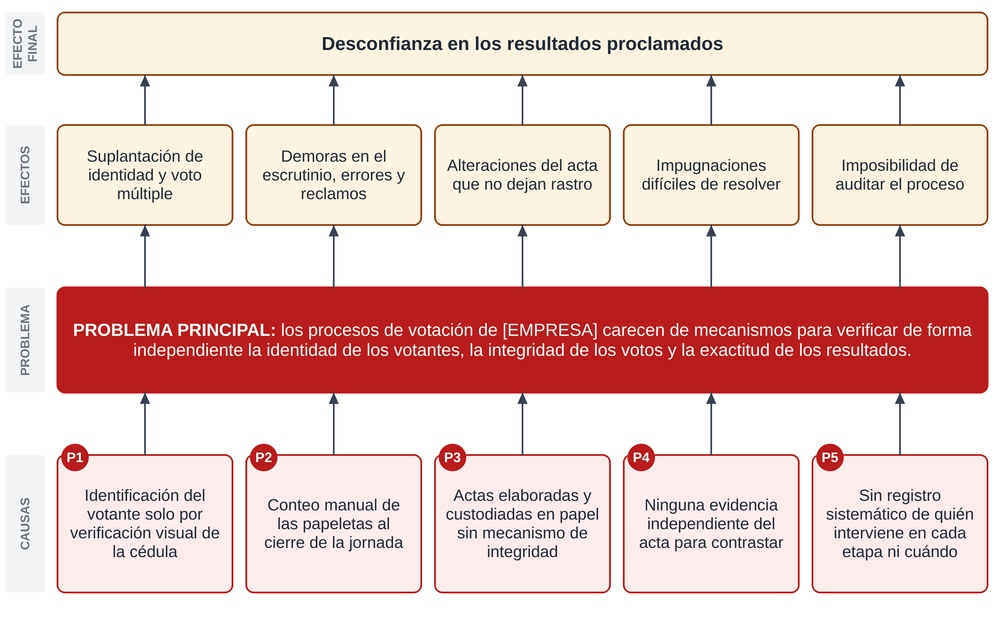
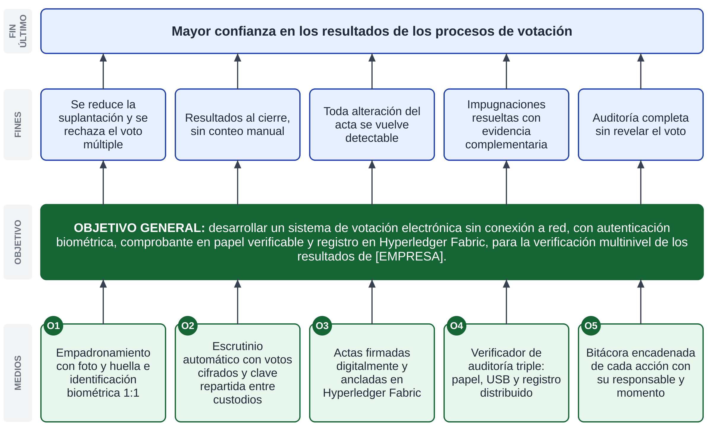

# ANEXOS {.unnumbered}

<!-- Reglamento Art. 48 + guía de la tutora (orden de la guía):
 - Estadísticas iniciales (si corresponde), DFD de la situación actual (está en 1.3.1)
 - Árbol de problemas                                               → Anexo A
 - Árbol de objetivos                                               → Anexo B
 - Manual de usuario (operación + cómo hacer backups)               → Anexo C (docs/manuales/)
 - Manual técnico (hardware/software, instalación, mantenimiento)   → Anexo D (docs/manuales/)
 - Fotos/documentos del proceso manual, esquema del TG
 - Formularios de métricas de calidad, conteo de líneas de código (herramienta)
 - Avales: institución, tutor metodológico, tutor, acta pre-defensa
 Las figuras se regeneran con docs/diagramas/generar.sh. Los Anexos C y D los agrega
 exportar_word.sh al final del informe completo. -->

## Anexo A. Árbol de problemas {.unnumbered}

El árbol de problemas relaciona las causas identificadas en la situación actual (los problemas secundarios del apartado 1.3.3) con el problema principal y con los efectos que este produce en los procesos de votación de [EMPRESA].

::: {custom-style="Rotulo Figura"}
**Figura A1**

*Árbol de problemas*
:::

::: {custom-style="Imagen Figura"}
{width=16cm}
:::

::: {custom-style="Nota Figura"}
*Nota.* Elaboración propia. P1 a P5 corresponden a los problemas secundarios del apartado 1.3.3.
:::

## Anexo B. Árbol de objetivos {.unnumbered}

El árbol de objetivos se obtiene al expresar cada elemento del árbol de problemas como una situación alcanzada: cada causa se convierte en un medio, que corresponde a un objetivo específico; el problema principal, en el objetivo general; y los efectos, en los fines que se persiguen.

::: {custom-style="Rotulo Figura"}
**Figura B1**

*Árbol de objetivos*
:::

::: {custom-style="Imagen Figura"}
{width=16cm}
:::

::: {custom-style="Nota Figura"}
*Nota.* Elaboración propia. O1 a O5 corresponden a los objetivos específicos del apartado 1.4.2.
:::
