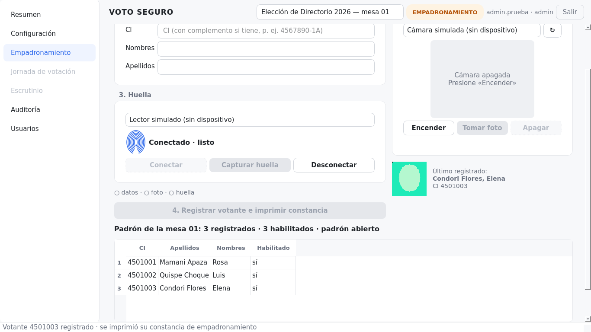
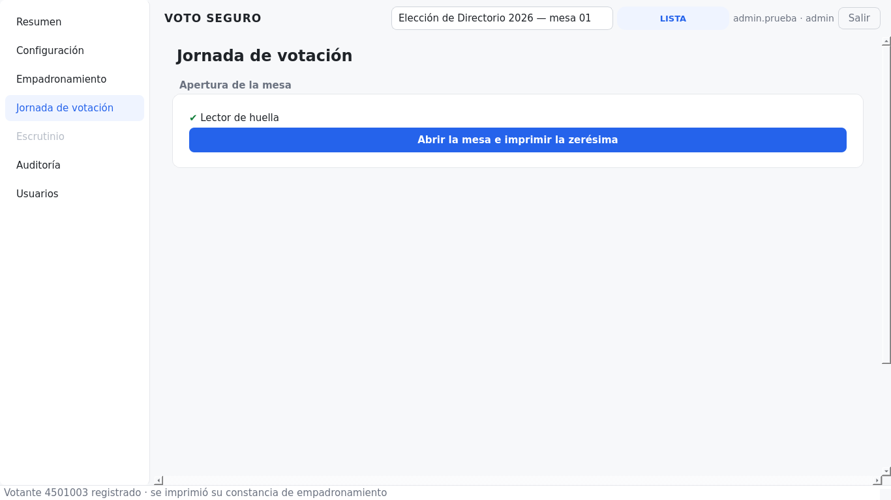
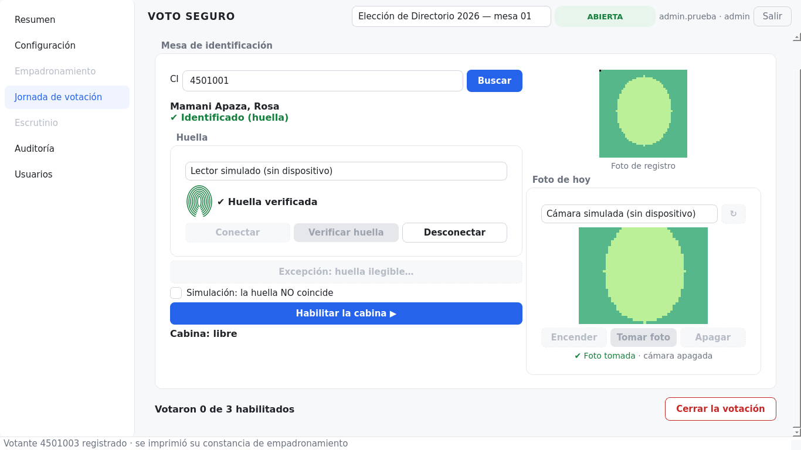
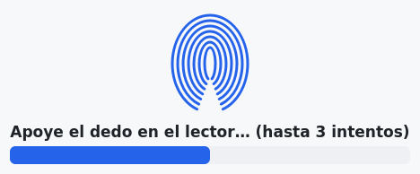
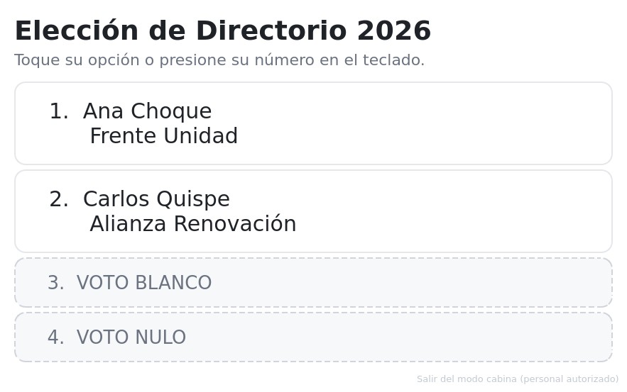
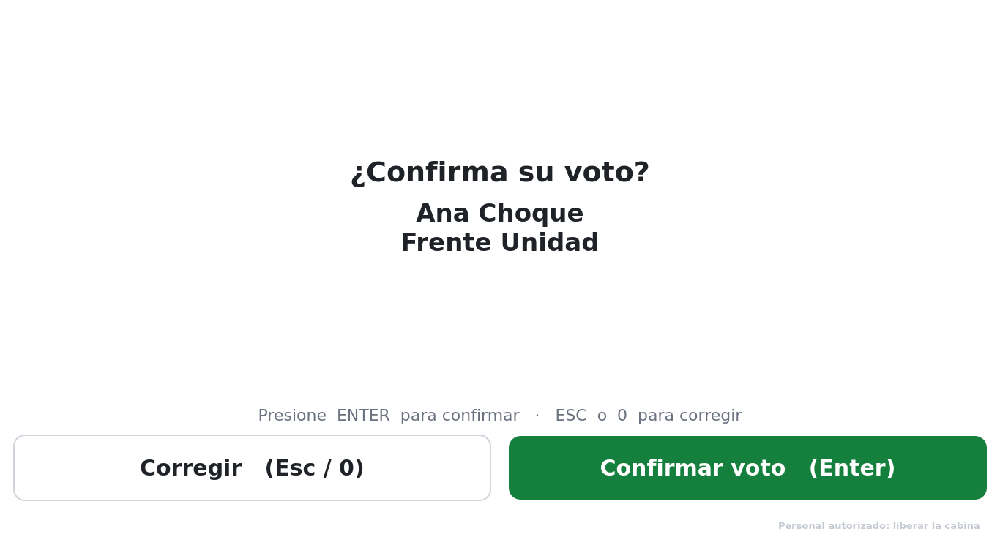
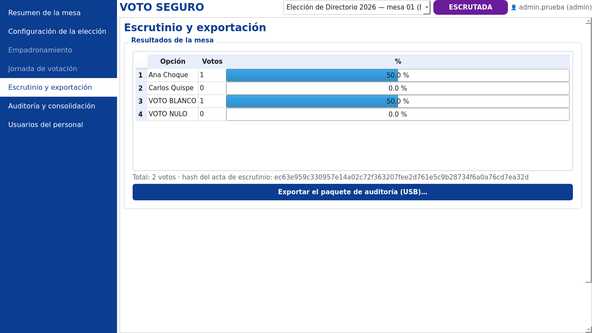
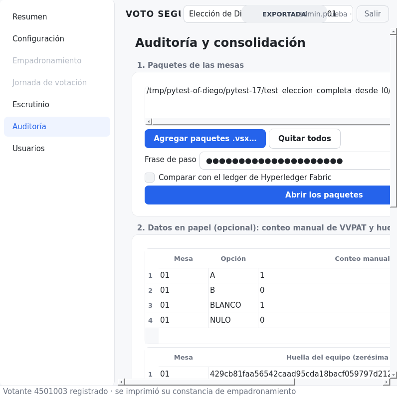

# Anexo A. Manual de usuario y guía de capacitación {.unnumbered}

## Cómo usar este manual

Este manual explica, en palabras sencillas, cómo se usa VOTO SEGURO durante una votación real. Está pensado para personas que **no son del área de sistemas**: el personal de mesa, los custodios de la clave, los delegados y los auditores. No necesita conocimientos de computación más allá de usar un ratón y un teclado.

- Si usted es **operador de mesa**, lea las secciones 1 a 9.
- Si usted es **custodio**, lea las secciones 1, 2 y 8.
- Si usted es **delegado** o **auditor**, lea las secciones 1, 2, 5, 9 y 10.
- La instalación y la configuración técnica del equipo están en el **Manual técnico**.

> **Importante:** el equipo ya llega instalado y configurado por el personal técnico. Este manual empieza cuando el equipo está listo para usarse.

## 1. ¿Qué es VOTO SEGURO? (en palabras simples)

VOTO SEGURO es una **urna electrónica** que reemplaza a la papeleta y al conteo a mano, pero **sin perder el papel**:

1. La persona que va a votar se identifica con su **carnet**, su **huella** y una **foto**.
2. Vota en una **pantalla**, tocando o presionando el número de su candidato.
3. La máquina imprime un **comprobante** con su elección. La persona lo revisa y lo deposita en la **urna de papel**.
4. Al final del día, la máquina **cuenta sola** los votos y todo se puede **revisar tres veces**: con los comprobantes de papel, con la memoria USB y con un registro que nadie puede alterar sin que se note.

**Nadie puede saber por quién votó una persona**, ni siquiera el personal de la mesa ni el técnico. Y **nadie puede ver resultados antes del cierre**: para abrir la urna digital se necesitan tres de los cinco custodios.

El equipo funciona **sin Internet, sin Wi-Fi y sin Bluetooth**. Nadie puede entrar desde afuera.

### Palabras que usará en este manual

| Palabra | Qué significa |
|---|---|
| **Mesa** | El lugar donde se vota; tiene un equipo VOTO SEGURO, una cabina y una urna de papel. |
| **Panel de mesa** | La pantalla del operador, donde se identifica a las personas. |
| **Cabina** | La pantalla donde la persona vota, en privado. |
| **Padrón** | La lista de personas que pueden votar en esta mesa. |
| **Comprobante** | El papel que imprime la máquina con el voto. La persona lo deposita en la urna; no se lo lleva. |
| **Zerésima** | El papel que se imprime al abrir la mesa y que demuestra que la urna estaba vacía. |
| **Custodio** | Persona que guarda, en un sobre sellado, una de las cinco partes de la clave que abre la urna digital. |
| **Acta** | El documento impreso con los totales al cerrar y con los resultados al escrutar. |
| **Paquete de auditoría** | El archivo que se guarda en la memoria USB al final, con toda la evidencia de la mesa. |

## 2. ¿Quién hace qué en la mesa?

| Persona | Qué hace | Necesita |
|---|---|---|
| **Presidente / operador de mesa** | Abre y cierra la mesa, identifica a cada votante y habilita la cabina | Usuario y contraseña de operador |
| **Custodios (5)** | Guardan su hoja con la parte de la clave y la presentan en el escrutinio | Su sobre sellado |
| **Delegados** | Observan, firman la zerésima y las actas y comparan los códigos impresos | Bolígrafo |
| **Votante** | Se identifica, vota en la cabina y deposita su comprobante | Su carnet de identidad |
| **Auditor** | Revisa al final los paquetes de todas las mesas y emite el informe | Usuario de auditor |
| **Técnico** (de guardia) | Resuelve problemas del equipo | Manual técnico |

## 3. Antes de la jornada (lista de control)

Marque cada punto antes de empezar:

- [ ] El equipo está **enchufado al UPS** (la batería de respaldo) y el UPS a la corriente.
- [ ] Las dos pantallas encienden: la del **panel** (mesa) y la de la **cabina**.
- [ ] El **lector de huella**, la **cámara** y la **impresora** están conectados.
- [ ] La impresora tiene **papel** y hay al menos **un rollo de repuesto**.
- [ ] La **cabina** tiene biombo o cortina: nadie puede ver la pantalla de la cabina desde la mesa.
- [ ] La **urna de papel** está vacía y sellada delante de los delegados.
- [ ] Los **cinco custodios** tienen su sobre sellado con la parte de la clave.
- [ ] Hay **dos memorias USB** vacías para el final.
- [ ] Las **etiquetas de seguridad** del equipo (puertos y tapa) están intactas.

## 4. Encender el sistema e ingresar

1. Encienda el equipo. Se abre VOTO SEGURO automáticamente.
2. Aparece **«Llavero del equipo»**: la persona responsable (administrador o técnico) escribe la **frase del llavero**. Esta frase protege las claves del equipo; **no la anote a la vista**.
3. Aparece **«Ingreso del personal»**: escriba su **usuario** y **contraseña** y presione **Ingresar**.
   - Si se equivoca **tres veces**, el sistema se bloquea **cinco minutos**. Espere y vuelva a intentar.
   - Cada ingreso, correcto o no, queda registrado con nombre y hora.
4. Se abre el **panel de mesa**. A la izquierda está el **menú**; arriba, el **estado** de la elección.

**Para salir** use el botón **Salir** (arriba a la derecha): le pedirá su contraseña otra vez. La ventana **no se cierra** con la «X»; esto es a propósito, para que nadie la cierre por error.

## 5. Antes de votar: empadronamiento y apertura

### 5.1. Registrar a las personas (empadronamiento)

Se hace **días antes** de la votación, en el mismo equipo.

1. Menú **Empadronamiento** → botón **Iniciar el empadronamiento** (solo la primera vez).
2. Al empezar la jornada, en el recuadro **3. Huella** presione **Conectar** (el lector queda conectado hasta que presione **Desconectar**). Si tiene una **cámara USB externa**, conéctela y elíjala en la lista del recuadro **2. Foto de registro** (botón **↻** para volver a buscar).

Con cada persona, siga los pasos numerados de la pantalla. Abajo se ve qué falta: «○ datos · ○ foto · ○ huella».

1. **Datos:** escriba el **CI** (con complemento si tiene), los **nombres** y los **apellidos**.
2. **Foto:** presione **Encender**, pida a la persona que **mire a la cámara** y presione **Tomar foto**. La cámara **se apaga sola** después de la foto (si no le gusta, presione **Encender** y tómela otra vez).
3. **Huella:** pida que **apoye el dedo índice** en el lector y presione **Capturar huella**. Aparece la ventana del lector («✔ Huella capturada»).
4. **Registrar:** cuando las tres marcas están en ✔, presione **Registrar votante e imprimir constancia**. La persona se agrega a la lista y se imprime su **constancia de empadronamiento** (con la foto y los datos), que se le entrega.

> Si cambia el CI después de tomar la foto o la huella, el sistema las descarta: eran de otra persona.

**Si alguien quedó registrado por error** (por ejemplo, en dos mesas): selecciónelo en la lista y presione **Inhabilitar…**, escribiendo el motivo. No se borra: queda constancia.

**Cuando terminó de registrar a todos**, presione **Cerrar el padrón**. Después ya no se puede agregar a nadie.

> Si hay **varias mesas**, el técnico hará el «cruce de padrones» para comprobar que ninguna persona esté en dos mesas (Manual técnico).

### 5.2. Abrir la mesa (el día de la votación)

1. Menú **Jornada de votación**.
2. Revise la lista de equipos: **lector de huella**, **cámara** e **impresora** deben tener un ✔ verde. En la mesa de identificación, presione **Conectar** en el recuadro **Huella**.
3. Presione **Abrir la mesa e imprimir la zerésima**. Se imprime la **zerésima**.
4. Los **delegados leen** la zerésima (votos en cero), **firman** y anotan el código de la «HUELLA DEL DISPOSITIVO».

## 6. Atender a cada votante (la rutina de 6 pasos)

Esta es la tarea que más repetirá durante el día. Practíquela en la capacitación hasta hacerla de memoria.

> ### La rutina de la mesa
> 1. **Pida el carnet** y escriba el **CI**. Presione **Buscar**.
> 2. **Mire la foto de registro** y compárela con la persona que tiene enfrente.
> 3. **Foto de hoy:** presione **Encender**, pida que mire a la cámara y presione **Tomar foto** (la cámara se apaga sola).
> 4. Pida que **apoye el dedo** y presione **Verificar huella**. Aparece la ventana del lector. Si coincide: «✔ Huella verificada» y «✔ Identificado».
> 5. Presione **Habilitar la cabina**. La cabina se activa para esa persona.
> 6. Indique a la persona que **pase a la cabina**. Cuando termine, usted atiende a la siguiente.
>
> **Con un solo monitor** (por ejemplo, una laptop), al habilitar la cabina **la misma pantalla se convierte en la cabina** y el panel queda oculto mientras la persona vota. Al terminar, vuelve el panel automáticamente.

**Lo que debe decirle al votante** (guion sugerido):

> «Pase a la cabina. Toque el nombre de su candidato o presione su número. Le preguntará si confirma: presione ENTER para confirmar o ESC para corregir. Saldrá un papel: revíselo y deposítelo en la urna. El papel no se lleva.»

**En la cabina, el votante ve:**

1. Las opciones con número: **1, 2, 3…**, más **VOTO BLANCO** y **VOTO NULO**.
2. Al elegir, una pantalla le pregunta **«¿Confirma su voto?»**:
   - **ENTER** (o el botón verde) → confirma.
   - **ESC** o **0** (o el botón blanco) → vuelve a elegir.
3. «✔ ¡Gracias! Su voto fue registrado» con el **código** del comprobante. La persona presiona **Finalizar (Enter)** o espera 7 segundos (la cuenta regresiva se ve en pantalla) y la pantalla vuelve a la mesa.

**Reglas de oro en la mesa:**

- **Nunca** mire ni se acerque a la pantalla de la cabina mientras alguien vota.
- **Nunca** vote ni presione botones en la cabina por otra persona. Si alguien necesita ayuda, siga el reglamento de su institución (por ejemplo, un acompañante elegido por el votante) y anótelo.
- El votante **no se lleva** el comprobante: lo deposita en la urna de papel.
- No fotografíe pantallas ni comprobantes.

## 7. ¿Qué hago si…? (situaciones especiales)

| Situación | Qué ve | Qué hacer |
|---|---|---|
| **La huella no coincide** | «✘ La huella no coincide» después de 3 intentos | Pida que limpie y seque el dedo (el mismo que se registró) y lo apoye plano y centrado; puede presionar **Verificar huella** otra vez. Si sigue fallando, **verifique el carnet y la foto con cuidado** y use **Excepción: huella ilegible…**, escribiendo el motivo. Queda registrado y se informa en el acta. |
| **La persona no está en el padrón** | «✘ el CI … no figura en el padrón» | Revise que el número esté bien escrito. Si es correcto, la persona **no puede votar en esta mesa**: indíquele que consulte al comité electoral. |
| **La persona ya votó** | «✘ el CI … ya emitió su voto» | No puede votar de nuevo. Informe al presidente de mesa; queda registrado el intento. |
| **La persona está inhabilitada** | «✘ … no está habilitado» | Consulte al comité electoral (por ejemplo, estaba registrada en otra mesa). |
| **La impresora se queda sin papel** | Mensaje «El voto quedó registrado pero el comprobante NO se imprimió» | El voto **ya está guardado**. Cambie el rollo y presione **Reimprimir comprobante pendiente**. El comprobante saldrá marcado «REIMPRESIÓN». |
| **La cabina no aparece al frente** | La pantalla de la cabina sigue en «espere» | Presione otra vez **Habilitar la cabina**. Si no responde, llame al técnico. |
| **Corte de luz** | El UPS empieza a pitar | El equipo sigue funcionando con la batería. Avise al técnico. No apague el equipo. |
| **Aviso de «Hyperledger Fabric no disponible»** | Mensaje en el resumen o al iniciar | La votación **sigue normalmente**: los registros se guardan y se envían después. Avise al técnico. |
| **Un votante deja la cabina sin votar** | La cabina sigue mostrando las opciones | Con dos monitores: en el panel, **Liberar la cabina (el votante no votó)…** y escriba el motivo. Con un solo monitor: en la cabina, el texto pequeño **«Personal autorizado: liberar la cabina»** (abajo a la derecha) pide la contraseña de un operador. La persona queda como **que no votó**. Queda registrado. |
| **Se olvidó la contraseña** | — | Solo el administrador puede crear usuarios. No comparta su contraseña con nadie. |

## 8. Cierre y escrutinio

### 8.1. Cerrar la votación

1. Cuando termine el horario y no haya nadie en la cabina, en **Jornada de votación** presione **Cerrar la votación** y confirme.
2. Se imprimen:
   - el **acta de cierre** (cuántas personas votaron y los códigos de control), y
   - la **lista de quienes no votaron**.
3. Los **delegados firman** el acta de cierre.

### 8.2. Contar los votos con los custodios (escrutinio)

1. Menú **Escrutinio**.
2. Cada custodio **abre su sobre** delante de todos y escribe (o lee con el lector de códigos QR) el texto de su hoja, que empieza con **VS1-**. Se necesitan **al menos tres**.
3. Presione **Reconstruir la clave y contar los votos**.
4. Aparecen los **resultados** y se imprime el **acta de escrutinio**. Los delegados la firman.

> Si un custodio escribió mal su texto, el sistema avisa («error al transcribir») y no se pierde nada: corrija y vuelva a intentar.

### 8.3. Recuento en papel (control)

Los delegados abren la **urna de papel** y cuentan los comprobantes por candidato. El número debe coincidir con el acta de escrutinio. Este conteo se entrega al auditor.

## 9. Guardar el respaldo (memoria USB)

1. En **Escrutinio**, presione **Exportar el paquete de auditoría (USB)…**.
2. Elija la memoria USB y escriba una **frase de paso** (dos veces). Anote la frase en un sobre que guarda el presidente del comité.
3. **Copie** el archivo `votoseguro_…_mesaNN.vsx` de la primera memoria a la **segunda memoria USB** (el paquete se genera una sola vez; la copia es idéntica y se verifica igual).
4. Entregue las memorias, las actas firmadas, la urna de papel y los sobres de los custodios al comité electoral.

## 10. Revisar los resultados (auditor)

1. Menú **Auditoría** → **Agregar paquetes .vsx…** (uno por mesa) y escriba la frase de paso.
2. Presione **Abrir los paquetes**.
3. En la tabla, escriba el **conteo de papel** de cada mesa y la **huella del equipo** anotada en la zerésima.
4. Presione **Verificar y consolidar**.
5. El resultado es **CONFORME** (todo coincide) o **CON DISCREPANCIAS** (con la explicación de qué no coincide). Presione **Guardar el informe de auditoría (PDF)…**.

## 11. Instrucciones para el votante (cartel para imprimir)

> ### ¿CÓMO VOTAR?
> 1. Entregue su **carnet** a la mesa.
> 2. Mire a la **cámara** y apoye su **dedo** en el lector.
> 3. Pase a la **cabina**.
> 4. **Toque** el nombre de su candidato o presione su **número**.
> 5. Presione **ENTER** para confirmar (o **ESC** para corregir).
> 6. **Revise** el papel que sale y **deposítelo en la urna**.
>
> **Su voto es secreto. Nadie puede saber por quién votó.**

## 12. Plan de capacitación

| Sesión | Duración | Contenido | Material |
|---|---|---|---|
| 1. Conceptos | 30 min | Qué es VOTO SEGURO, roles, secreto del voto, por qué no se necesita Internet | Secciones 1 y 2 |
| 2. Práctica guiada | 60 min | Ingreso, empadronamiento de 3 personas, apertura, la rutina de 6 pasos con 5 votantes, cierre, escrutinio con custodios | Equipo de práctica con una elección de prueba |
| 3. Situaciones especiales | 30 min | Cada participante resuelve un caso de la sección 7 (huella que falla, persona que ya votó, papel que se acaba) | Tarjetas con casos |
| 4. Simulacro | 60–90 min | Votación completa con 15–20 personas, cierre, escrutinio, USB y auditoría; encuesta de satisfacción (SUS) al final | Todo el equipamiento de la mesa |

**Evaluación del operador** (al final del simulacro): el operador puede, sin ayuda, (1) ingresar y salir, (2) abrir la mesa, (3) atender a un votante con la rutina de 6 pasos, (4) resolver una huella que falla, (5) reponer el papel y reimprimir, (6) cerrar, escrutar y exportar.

> **Para el capacitador:** el equipo de práctica puede usar el modo de simulación (huella y cámara simuladas, impresión en PDF). El técnico prepara una elección de prueba y la borra al terminar.

## 13. Preguntas frecuentes

**¿Alguien puede saber por quién voté?** No. Los votos se guardan cifrados, sin hora y mezclados; la lista de quién votó está separada de la urna. Ni el técnico puede unir una cosa con la otra.

**¿Y si alguien cambia los votos en la computadora?** Se detecta: los totales están firmados, anclados en un registro que no se puede reescribir y respaldados por los comprobantes de papel. El auditor compara las tres fuentes.

**¿Por qué tres custodios para contar?** Para que ninguna persona sola pueda abrir la urna digital antes de tiempo.

**¿Qué pasa si se corta la luz?** El equipo sigue con la batería del UPS. Los votos ya registrados no se pierden.

**¿Para qué la foto?** La foto del registro sirve para comparar con la persona que se presenta; la foto del día es evidencia de que la persona asistió. Ninguna de las dos se relaciona con el voto.
